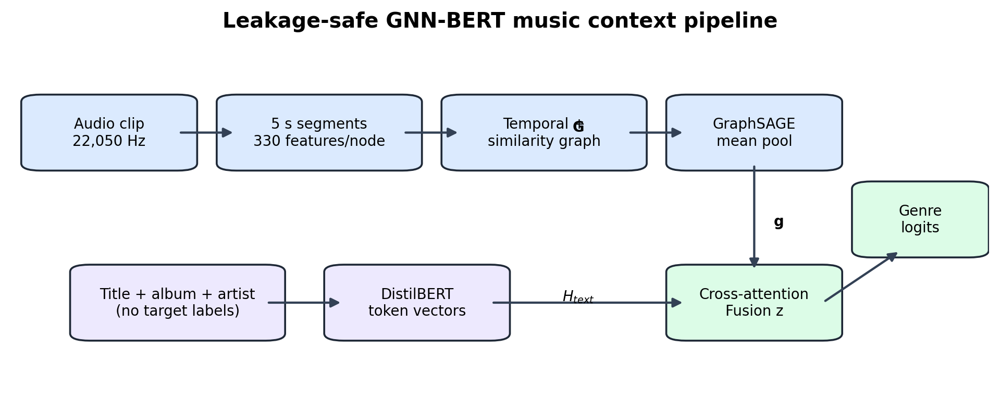
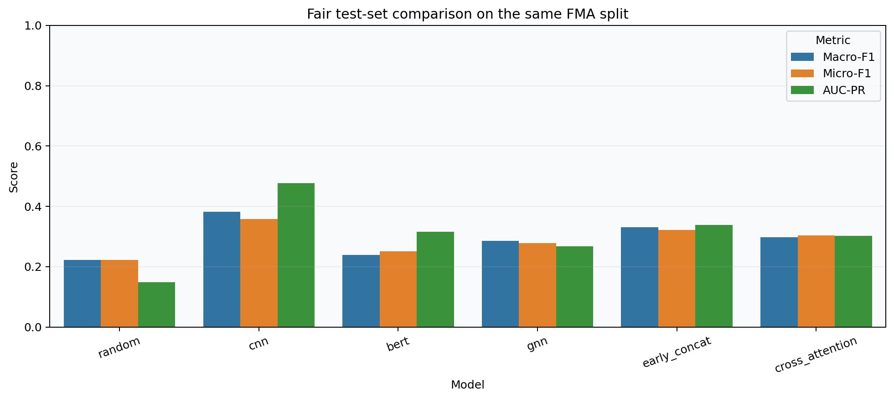

# Music Context Classification with GraphSAGE and DistilBERT

A team research project comparing audio, text, graph, and multimodal models for music genre classification. We built segment graphs from song audio, encoded track metadata with DistilBERT, and tested whether combining the two improved predictions on the FMA-small dataset.



## Key result

In the completed **quick experiment** (1,000 tracks: 800 training, 100 validation, 100 test), the mel-spectrogram CNN performed best. It reached **0.382 macro-F1** and **0.477 macro AUC-PR** on the test subset. Early concatenation was the strongest fusion model at **0.331 macro-F1**. These results do not show an improvement from fusion over the CNN in this run.

| Model | Test macro-F1 | Test macro AUC-PR |
| --- | ---: | ---: |
| Random/prevalence | 0.222 | 0.148 |
| CNN on mel spectrograms | **0.382** | **0.477** |
| DistilBERT on metadata | 0.239 | 0.315 |
| GraphSAGE on audio segment graphs | 0.286 | 0.268 |
| Early concatenation | 0.331 | 0.338 |
| Cross-attention fusion | 0.298 | 0.302 |

The full metrics, split audit, plots, and report are in [`results/`](results/), [`plots/`](plots/), and [`report/final_report.pdf`](report/final_report.pdf). The saved results use the `quick` profile, not the full 8,000-track training profile. See [`results/evaluation_table.md`](results/evaluation_table.md) for the full table including micro-F1.

## Approach

- **Audio graph:** split each track into five-second segments; extract spectral, chroma, MFCC, energy, and related features; connect adjacent and acoustically similar segments; encode the graph with GraphSAGE.
- **Text:** encode track title, album title, and artist name with DistilBERT. Genre labels are excluded from the text input.
- **Comparison:** evaluate random/prevalence, CNN, text-only, graph-only, early concatenation, and cross-attention models on the same official FMA split.
- **Evaluation:** tune decision thresholds on validation data and report macro-F1, micro-F1, and area under the precision-recall curve on the test subset.



## Reproduce the experiment

The project needs Python, the packages in [`requirements.txt`](requirements.txt), and the [FMA-small audio and metadata](https://github.com/mdeff/fma). The dataset and trained checkpoints are intentionally excluded from Git; [`config.yaml`](config.yaml) records the experiment settings.

The easiest route is the [Colab notebook](notebooks/CSE425_Full_Project_Colab.ipynb). Open it in Google Colab, select a GPU runtime, run the smoke test, then select `RUN_PROFILE = "quick"` or `"final"` for the desired run. The final profile is more expensive and its results are not the ones reported above.

For a local run:

```bash
python -m pip install -r requirements.txt
python -m src.download_data --config config.yaml --dataset fma_small
python -m src.preprocess --config config.yaml --profile quick
python -m src.audit_splits --config config.yaml
python -m src.run_all --config config.yaml --profile quick
python -m src.export_results --config config.yaml
```

## Repository guide

| Path | Contents |
| --- | --- |
| [`src/`](src/) | Data processing, model definitions, training, evaluation, and export code |
| [`notebooks/`](notebooks/) | Colab workflow, exploration, and demo |
| [`tests/`](tests/) | Core and fusion model tests |
| [`plots/`](plots/) | Saved figures from the quick experiment |
| [`results/`](results/) | Saved metrics, predictions, and split audit |
| [`report/`](report/) | Research report and LaTeX source |
| [`docs/`](docs/) | Colab guide and course documentation |

## Scope and limitations

The reported test subset has 100 tracks, so the numbers should be treated as a small experiment, not a benchmark claim. The FMA-small task has one positive top-level genre per track; the code also supports a separate multi-label mode. The fusion models were functional but did not outperform the CNN in this run. The full-size final profile has not been represented as completed here.

## Team and attribution

This was a team project by **Maskat Ibne Wahid, Zannaty Aziza, and Abdur Rahman Piash** at BRAC University. The research report contains the full methodology and references. The audio and metadata come from the [Free Music Archive dataset](https://github.com/mdeff/fma).
